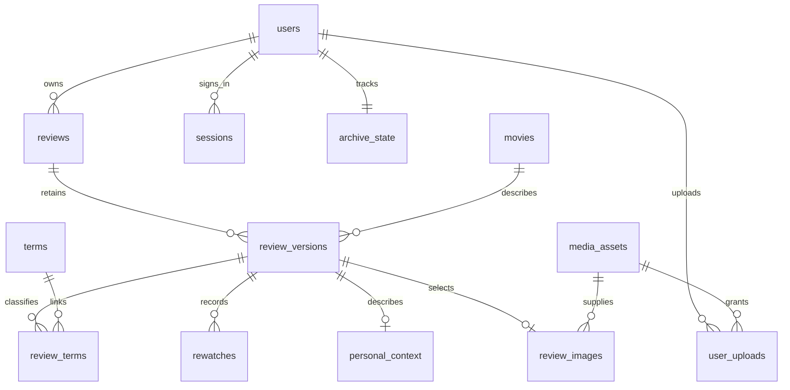

# 用户管理与数据库模型（Schema v2）

## 存储现状

桌面版使用用户选择目录中的 `movie-reviews.json`，由 `app.py` 的 `ReviewStore` 校验、原子替换并保留历史 JSON 备份。剧照原文件按内容哈希保存在 `media/`。

网页版使用 `<MOVIE_REVIEW_DATA_DIR>/db/app.sqlite3`。变更前，`account` 仅允许单账户，`reviews(id,payload,revision,updated_at)` 用 JSON 文本保存整条影评，没有用户外键。此次更新保留 SQLite，当前影评与历史版本均改用关系字段，不再持久化影评 `payload`。API 和 JSON/ZIP 导入导出仍组装原有 JSON，以兼容桌面档案。

## 表及粒度

| 表 | 一行表示什么 | 主键及关系 |
| --- | --- | --- |
| `users` | 一位用户的账户、显示名、密码哈希、角色和启用状态 | `id` 主键；`username` 唯一 |
| `sessions` | 一次登录会话 | `token_hash` 主键；用户外键 |
| `archive_state` | 一位用户的整份档案修改版本 | `user_id` 主键及用户外键 |
| `reviews` | 某位用户拥有的一条影评身份 | 内部 `id` 主键；`user_id → users.id`；`(user_id,public_id)` 唯一 |
| `review_versions` | 某条影评在某次保存时的完整业务版本 | `id` 主键；影评、电影资料外键 |
| `movies` | 一份电影名称和导演资料 | `id` 主键；影评版本通过外键引用 |
| `terms` | 一个分类名或标签名 | `id` 主键；`(kind,name)` 唯一 |
| `review_terms` | 某影评版本与一个分类或标签的关联 | `(version_id,term_id)` 主键；原数组顺序 |
| `rewatches` | 某影评版本中的一次重看 | `(version_id,position)` 主键；时间、感受、可空评分 |
| `personal_context` | 某影评版本的个人观影背景 | `version_id` 主键；地点、同行人、心情等明确列 |
| `media_assets` | 一份按哈希保存的媒体原文件 | `reference` 主键；类型与大小 |
| `review_images` | 某影评版本选择的主剧照 | `version_id` 主键；媒体外键及使用时的原始文件名 |
| `user_uploads` | 一位用户对其上传文件的访问授权 | `(user_id,reference)` 主键；用户、媒体外键 |
| `idempotency` | 一位用户的一次创建重试标识 | `(user_id,request_key)` 主键；关联影评 |
| `login_failures` | 一次来源匿名化的登录失败事件 | `id` 主键；来源哈希与时间 |

`reviews.current_version_id` 指向当前内容；复合外键 `(reviews.id,current_version_id) → review_versions(review_id,id)` 保证版本属于该影评。用户归属只在影评身份表保存，版本、分类和重看不重复保存用户资料。评分、评论、日期只在版本表保存，当前视图从当前版本组装。



## 三范式依据

1. 第一范式：业务列保存标量；分类、标签、重看数组拆成逐行关系。个人背景和图片元数据拆成明确列，当前影评及历史版本不再使用 JSON 大字段。
2. 第二范式：主键确定全部属性。关联顺序依赖完整的“版本 + 词条”；一次重看依赖完整的“版本 + 次序”。词条名不在关联表重复保存。
3. 第三范式：非键字段不通过其他非键字段传递依赖于主键。账户资料、电影资料、词条名称、媒体类型与大小各自在所属实体中维护，影评表只通过外键引用。

片名不是可靠的电影唯一标识，因此迁移不按片名或“片名 + 导演”擅自合并电影。电影资料被历史版本引用后保持不变，修改片名或导演会创建新资料行，以保留历史原文。未来接入权威电影标识时再设计明确匹配规则。

导演、同行人等沿用原自由文本含义，不把逗号自动解释为多个实体。重看评分 `NULL` 表示未填写，`0` 是明确零分；重看意愿 `NULL` 表示未填写，`0` 表示明确不愿重看。数组顺序及这些差异在迁移、导出中保留。

参考：[Microsoft 数据库规范化说明](https://learn.microsoft.com/en-us/office/troubleshoot/access/database-normalization-description)、[SQLite 外键文档](https://www.sqlite.org/foreignkeys.html)。每个连接显式启用外键，迁移执行完整性和外键检查。

## 用户管理

首个初始化账户及旧版迁入账户为管理员。登录后从顶部档案状态栏进入“用户管理”，支持新增用户、编辑账户名及显示名、调整角色、启用/停用、重置密码。所有用户可验证当前密码后修改自己的密码。

普通用户没有用户管理权限。管理员管理账户时也不会因此获得他人档案的访问权限。影评增改删、详情、档案版本、批量替换、原图、缩略图、导出与导入确认均限定在登录用户内；用户编号不接受前端指定。公开影评 ID 和创建重试标识按用户隔离。

停用、修改账户名或角色、重置或自行修改密码会使该用户的会话失效。最后一位启用的管理员不能停用或降级。账户采用停用方式保留影评历史归属。

## 迁移、发布及回滚

首次打开旧网站库时，写入前用 SQLite 在线备份 API 创建 `backups/pre-schema-v2-*.sqlite3`，在单个事务中迁移账户、当前及历史影评、有效上传授权、重试标识及限流记录。原密码哈希保留，影评归到原账户，旧会话清空后重新登录。

迁移逐条比较当前影评字段与顺序，检查完整性及外键后设置 `PRAGMA user_version=2`。发现自动裁剪、ID 不一致、未知表或约束错误会回滚，原库和升级前备份均保留。已失去对应文件的临时上传授权，以及没有任何当前/历史影评身份的旧重试标识不转入新库，其原始记录仍在升级前备份中。

正式发布先停写，使用旧版备份工具生成并校验完整 ZIP，在隔离恢复目录用新代码执行：

```text
python -m web.manage --data-dir <隔离目录> upgrade-db
```

确认账户登录、影评、剧照及备份恢复后，对正式目录执行同一命令并切换程序。发布包必须包含 `web/schema.sql`。重复升级不会重新迁移或重置数据，命令输出版本、影评数、完整性、外键违规数与本次备份位置。

回滚时先停新程序，保留升级后的数据库与新增媒体，将升级前完整 ZIP 恢复到独立目录，并配套切回旧程序和旧数据目录。旧程序不能直接连接 v2 库，也不要用旧库覆盖未备份的新影评。

个人 ZIP 导出只有该用户当前影评和引用媒体，不含账户密码。服务器备份属于离线管理功能，保存全部用户、全部历史版本与对应媒体、已上传媒体授权；恢复清空会话。旧服务器备份仍可校验和隔离恢复。
